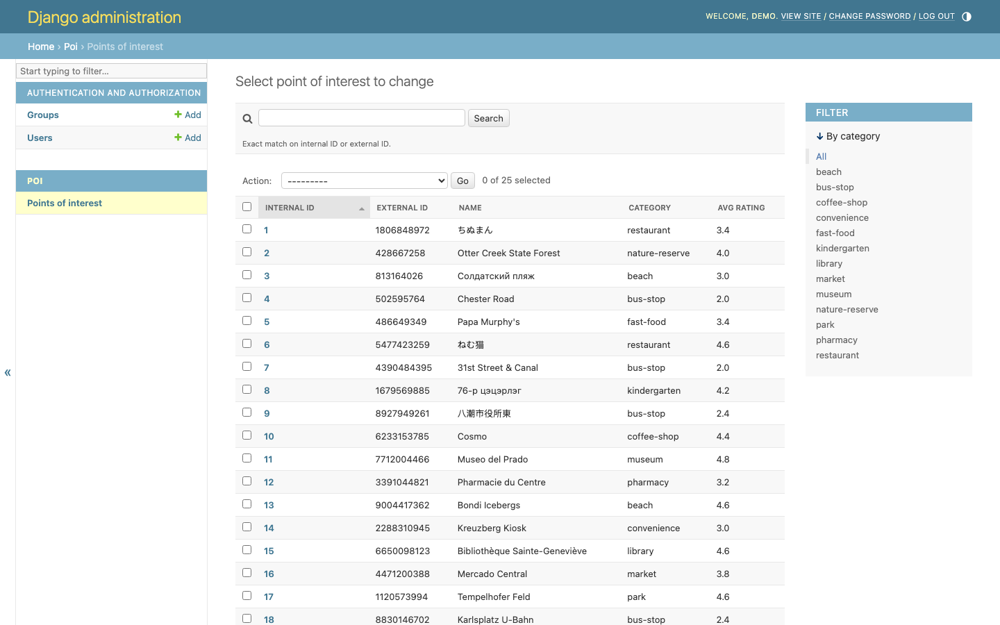
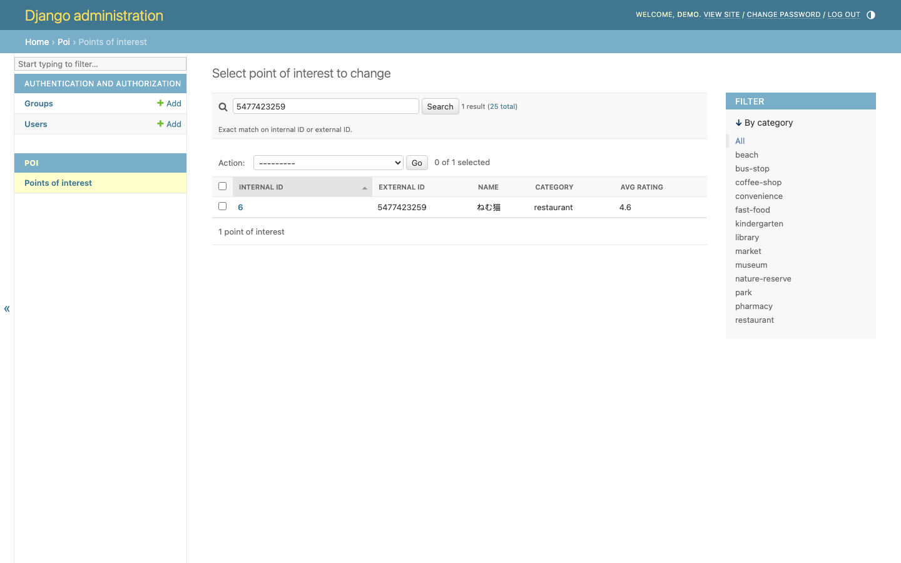
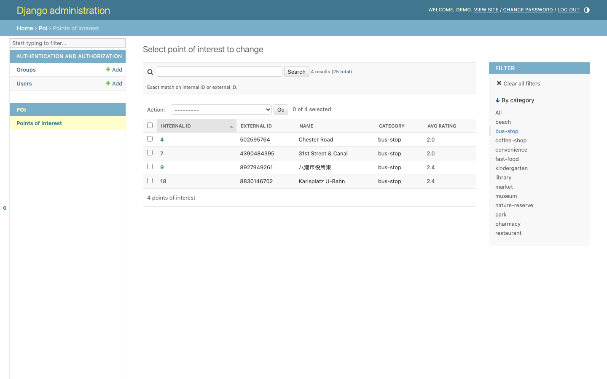
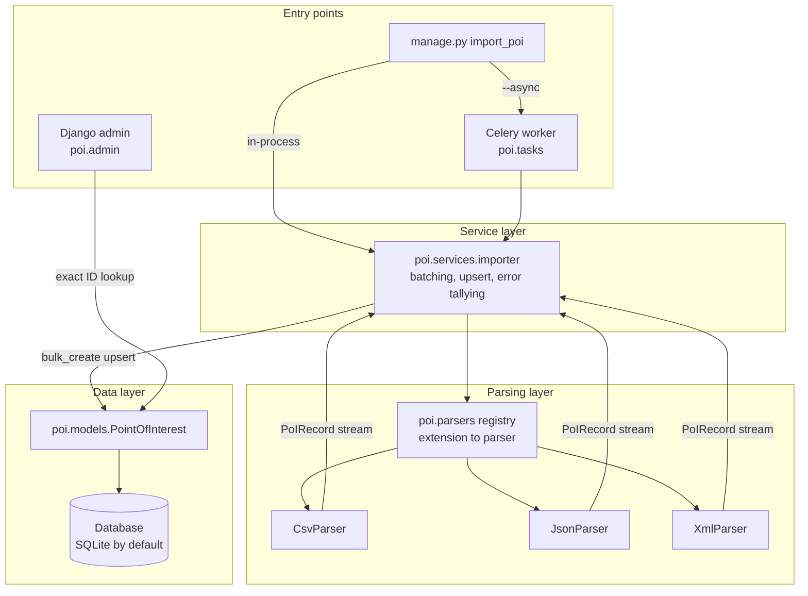
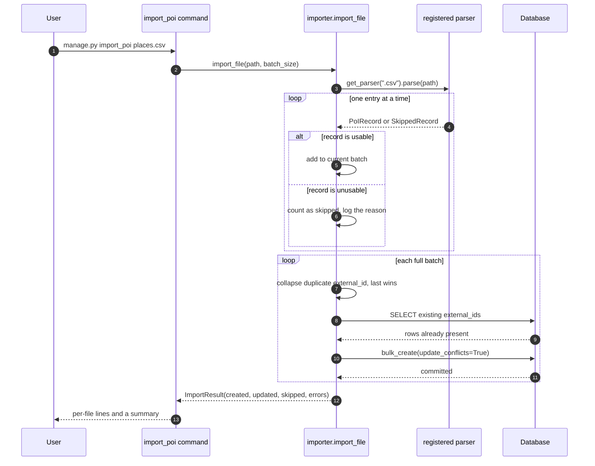

# SearchSmartly — Point of Interest importer

A Django project that loads Point of Interest (PoI) records from CSV, JSON and
XML files into a local database and lets you browse them in the Django admin.
Data enters through one management command, `import_poi`; the admin is the only
read interface. There is no public HTTP API.

Each PoI keeps two identifiers: the `external_id` it carried in the source file,
and the `internal_id` this database assigns. You can search on either, and filter
the list by category.

## Screenshots

The admin list, showing both identifiers, the category filter and the averaged
rating:



Searching by external ID returns exactly the one matching record:



Filtering by category:



### Captured command-line output

The full transcript is in [`docs/cli_session.txt`](docs/cli_session.txt).

```console
$ python manage.py import_poi poi/test_files/dummy.csv poi/test_files/valid_data.json poi/test_files/valid_data.xml
poi/test_files/dummy.csv: 0 created, 10 updated, 0 skipped
poi/test_files/valid_data.json: 2 created, 0 updated, 0 skipped
poi/test_files/valid_data.xml: 0 created, 2 updated, 0 skipped
Imported 2 new and 12 updated PoI records, skipped 0.

$ python manage.py import_poi poi/test_files/edge_cases.json  # unusable records are skipped, not fatal
WARNING poi.services.importer poi/test_files/edge_cases.json: item 1: missing or malformed 'coordinates' object
WARNING poi.services.importer poi/test_files/edge_cases.json: item 2: 'ratings' must be a list, got str
poi/test_files/edge_cases.json: 1 created, 0 updated, 2 skipped
Imported 1 new and 0 updated PoI records, skipped 2.
```

## Architecture



Dependencies point inward. Parsers know nothing about the database; the importer
is the only place that knows about both a `PoIRecord` and the ORM; the admin and
the management command are thin shells over the layers beneath them.

## Import workflow



## Quickstart

```bash
python3 -m venv .venv && source .venv/bin/activate
pip install -r requirements.txt

export DJANGO_DEBUG=1
python manage.py migrate
python manage.py createsuperuser

python manage.py import_poi poi/test_files/dummy.csv
python manage.py runserver
```

Then open <http://127.0.0.1:8000/admin/> and go to **Poi → Points of interest**.

Importing runs in-process by default and needs no message broker. Pass `--async`
to hand each file to a Celery worker instead:

```bash
celery -A SearchSmartly worker --loglevel=info      # in another shell
python manage.py import_poi places.csv --async
```

## Configuration

Every setting is read from the environment. Copy `.env.example` and adjust.

| Variable | Required | Default | Purpose |
| --- | --- | --- | --- |
| `DJANGO_SECRET_KEY` | Yes, unless `DJANGO_DEBUG` is on | — | Django signing key. Startup fails without it when `DEBUG` is off. |
| `DJANGO_DEBUG` | No | `0` | Enables Django's debug mode. Off by default so a missing env file cannot ship a debug server. |
| `DJANGO_ALLOWED_HOSTS` | No | `localhost,127.0.0.1,[::1]` | Comma-separated hostnames Django will serve. |
| `DJANGO_CSRF_TRUSTED_ORIGINS` | No | empty | Comma-separated origins trusted for CSRF, needed behind a proxy. |
| `DJANGO_LOG_LEVEL` | No | `INFO` (`CRITICAL` under `manage.py test`) | Root log level. |
| `DJANGO_TIME_ZONE` | No | `UTC` | Django `TIME_ZONE`. |
| `DJANGO_DB_ENGINE` | No | `django.db.backends.sqlite3` | Database backend. |
| `DJANGO_DB_NAME` | No | `<project>/db.sqlite3` | Database name or SQLite file path. |
| `DJANGO_DB_USER` | No | empty | Database user. |
| `DJANGO_DB_PASSWORD` | No | empty | Database password. |
| `DJANGO_DB_HOST` | No | empty | Database host. |
| `DJANGO_DB_PORT` | No | empty | Database port. |
| `DJANGO_SECURE_SSL_REDIRECT` | No | `1` when `DEBUG` is off | Redirect HTTP to HTTPS. Set to `0` when TLS terminates upstream. |
| `DJANGO_HSTS_SECONDS` | No | `31536000` | HSTS max-age, applied only when `DEBUG` is off. |
| `DJANGO_HSTS_PRELOAD` | No | `0` | Advertise the domain for the browser HSTS preload list. Off by default because preloading is effectively irreversible. |
| `CELERY_BROKER_URL` | Only for `--async` | `amqp://localhost:5672//` | Celery broker. |
| `CELERY_RESULT_BACKEND` | No | empty | Celery result backend. |
| `CELERY_TASK_ALWAYS_EAGER` | No | `0` (`1` under `manage.py test`) | Run tasks inline instead of dispatching them. |

## Development

```bash
pip install -r requirements-dev.txt

python manage.py test poi     # 52 tests, no network access, no broker
ruff check .                  # lint
ruff format .                 # format
```

The test suite installs a socket guard (`poi/tests/__init__.py`) that raises on
any outbound connection, so a test cannot pass merely because the machine
running it has connectivity.

To reproduce the performance numbers quoted below:

```bash
python docs/benchmark_import.py 50000 200000
```

## Project structure

```
SearchSmartly/            Django project: settings, Celery app, URLs
poi/
  admin.py                Admin list, category filter, exact-ID search
  models/                 PointOfInterest, its indexes and ordering
  parsers/                Format adapters and the extension registry
    base.py               PoIRecord, SkippedRecord, the Parser protocol
    csv_parser.py         Streaming CSV reader (stdlib csv)
    json_parser.py        JSON array reader
    xml_parser.py         Streaming XML reader (iterparse)
  services/
    importer.py           Batching, upsert and error tallying
  tasks.py                Celery entry point, a thin shell over the service
  management/commands/
    import_poi.py         The CLI, also a thin shell over the service
  test_files/             Sample files the tests actually read
  tests/                  Parser, importer, admin-search and CLI tests
docs/
  benchmark_import.py     The benchmark behind the numbers below
  benchmark_import.txt    Its captured output
  cli_session.txt         A captured command-line transcript
  screenshots/            Admin screenshots used above
```

## Design notes

**Parsing is separated from persistence.** A parser turns bytes into a stream of
`PoIRecord` values and knows nothing about Django. The importer is the only
component aware of both a record and the ORM. This is what makes the parsers
testable against the real sample files without a database, and it means adding a
format cannot accidentally change how rows are written.

**The parser registry is the extension seam.** Adding a format means writing a
class with an `extensions` tuple and a `parse` method, then calling
`poi.parsers.register()`. The importer, the management command and the Celery
task are untouched. The command's `--help` output lists supported extensions
from the registry, so it stays accurate on its own.

**Per-record failures travel in the stream, not as exceptions.** A parser yields
`SkippedRecord` for an entry it cannot use. This matters because a generator that
raises is finished: raising per record would silently truncate an import at the
first bad row. A problem with the file as a whole — a missing column, malformed
XML — still raises `ParseError` and fails that file, because importing part of a
misunderstood file is worse than importing none of it.

**The two identifiers are kept distinct.** `external_id` is the ID from the source
file and is unique and indexed; `internal_id` is the database's own key. Import
upserts on `external_id`, so re-running an import refreshes rows rather than
duplicating them.

**Admin ID search is exact, not substring.** Django's default `search_fields`
behaviour is `icontains`, which is wrong for an identifier: searching for `1`
would also match `1806848972`, `813164026` and every other ID containing that
digit. `PointOfInterestAdmin.get_search_results` does an exact comparison on
`external_id`, plus an exact comparison on `internal_id` when the term is an
integer the column can hold.

**The model carries an explicit ordering.** Without one, `LIMIT`/`OFFSET` paging
is not stable and rows can repeat or disappear between pages; Django raises
`UnorderedObjectListWarning` for exactly this. `Meta.ordering = ("internal_id",)`
makes paging deterministic, and there is a test that walks every page and asserts
the pages partition the table.

### Scalability

The bottleneck was writes, not parsing. The original importer called
`PointOfInterest.objects.create()` once per row. Importing is now batched through
`bulk_create` with `update_conflicts=True`, and every parser streams.

Measured on this machine (Python 3.13.7, SQLite 3.53.4) with
`python docs/benchmark_import.py 50000 200000`; full output in
[`docs/benchmark_import.txt`](docs/benchmark_import.txt):

| Rows | Strategy | Time | INSERT statements | Peak Python memory |
| --- | --- | --- | --- | --- |
| 50,000 | per-row `objects.create` | 9.16 s | 50,000 | 0.3 MB |
| 50,000 | `bulk_create`, batch 500 | 3.50 s | 400 | 0.8 MB |
| 200,000 | per-row `objects.create` | 35.39 s | 200,000 | 0.1 MB |
| 200,000 | `bulk_create`, batch 500 | 14.45 s | 1,600 | 0.8 MB |

About 2.5x faster, with 125x fewer INSERT statements. SQLite caps a parameterised
statement at 999 variables, so Django splits a 500-row batch into 4 statements at
6 columns per row; the win comes from far fewer round trips and transactions
rather than from one giant insert.

XML parsing was the other problem. The original code called
`ElementTree.parse()`, which builds the whole document in memory before the first
record is available. `iterparse` with per-element `clear()` replaces it:

| Rows | XML strategy | Time | Peak Python memory |
| --- | --- | --- | --- |
| 50,000 (10.4 MB) | `ElementTree.parse` | 0.58 s | 52.1 MB |
| 50,000 (10.4 MB) | `iterparse` + `clear` | 1.09 s | 0.2 MB |
| 200,000 (42.0 MB) | `ElementTree.parse` | 2.43 s | 208.0 MB |
| 200,000 (42.0 MB) | `iterparse` + `clear` | 4.37 s | 0.2 MB |

Streaming is about 1.8x slower per element and uses a flat 0.2 MB instead of five
times the document size. That trade is worth taking for an importer whose whole
job is large files.

Two indexes back the admin: `external_id` is unique and indexed for search, and a
composite `(category, internal_id)` index serves the category filter together with
the default ordering.

`pandas` and `numpy` were removed. The importer consumes one row at a time, so a
DataFrame bought nothing and cost roughly 60 MB of installed dependencies; the
standard library `csv` module streams in constant memory.

## Limitations

- **JSON is read whole.** `json.load` materialises the document before any record
  is yielded, so peak memory scales with JSON file size. CSV and XML stream.
  The standard library has no incremental JSON array reader and adding a
  streaming JSON dependency was not worth it at these file sizes.
- **No HTTP API.** The admin is the only read interface. There are no public
  endpoints and no serialisers.
- **Coordinates are plain floats.** There is no geospatial index and no
  proximity search; `PostGIS` and `django.contrib.gis` would be the route if
  "find PoIs near me" were ever required.
- **Individual ratings are not retained**, only their mean, which matches the
  admin column the brief asks for but means the average cannot be recomputed or
  audited after import.
- **Duplicate resolution is last-one-wins.** Within a file and across re-imports,
  a repeated `external_id` overwrites the earlier row. There is no merge policy
  and no history.
- **The Docker images are unbuilt.** `Dockerfile` and `docker-compose.yml` are
  written and `docker compose config` parses, but neither has been built or
  booted here.
- **`--async` has no result backend by default**, so a queued import reports its
  outcome only to the worker's log unless `CELERY_RESULT_BACKEND` is set.
