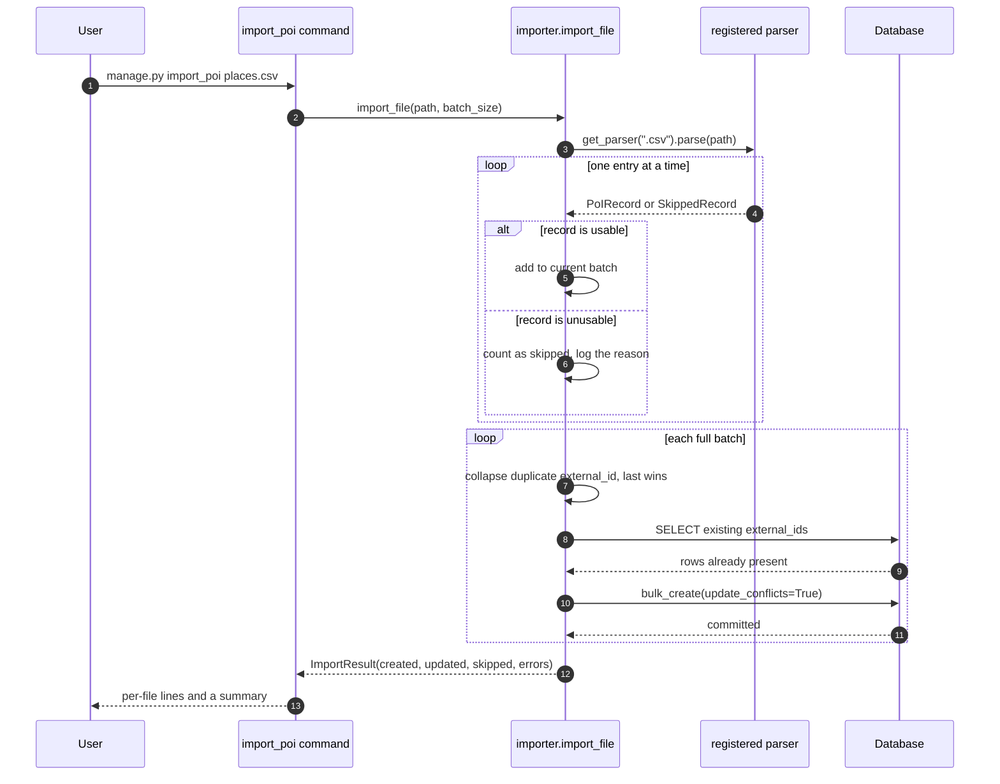

# SearchSmartly — Point of Interest importer

A Django project that loads Point of Interest (PoI) records out of CSV, JSON and
XML files and lets you browse them in the Django admin. One management command,
`import_poi`, gets data in; the admin is the only way to read it back, and there
is no public HTTP API.

Every record keeps two identifiers: the `external_id` it carried in the source
file, and the `internal_id` this database assigns. The admin looks up either one
— exactly, never as a substring — and filters the list by category.

## Get it running

```bash
python3 -m venv .venv && source .venv/bin/activate
pip install -r requirements.txt

export DJANGO_DEBUG=1
python manage.py migrate
python manage.py createsuperuser

python manage.py import_poi poi/test_files/dummy.csv
python manage.py runserver
```

Open <http://127.0.0.1:8000/admin/> and go to **Poi → Points of interest**.

Importing runs in-process and needs no message broker. `DJANGO_DEBUG=1` is there
only so you need not generate a key first: with `DEBUG` off, startup refuses to
continue until `DJANGO_SECRET_KEY` is set.

## Feeding it files

`import_poi` accepts any number of paths and chooses a parser per extension
(`.csv`, `.json`, `.xml`). A record the parser cannot use is counted, logged and
skipped — the rest of the file still loads. A problem with the file *as a whole*
(a missing column, malformed XML) fails that file and exits non-zero, because
importing part of a misunderstood file is worse than importing none of it.

```console
$ python manage.py import_poi poi/test_files/dummy.csv poi/test_files/valid_data.json poi/test_files/valid_data.xml
poi/test_files/dummy.csv: 0 created, 10 updated, 0 skipped
poi/test_files/valid_data.json: 2 created, 0 updated, 0 skipped
poi/test_files/valid_data.xml: 0 created, 2 updated, 0 skipped
Imported 2 new and 12 updated PoI records, skipped 0.
```

Re-imports, skipped records, both failure modes with their exit statuses and
`--help` are in the captured transcript,
[`docs/cli_session.txt`](docs/cli_session.txt).

To hand each file to a Celery worker instead of importing in-process:

```bash
celery -A SearchSmartly worker --loglevel=info      # in another shell
python manage.py import_poi places.csv --async
```

## What one import actually does



A parser knows nothing about the database. It yields a `PoIRecord`, or a
`SkippedRecord` carrying the reason, and those failures travel *in the stream*
rather than as exceptions: a generator that raises is finished, so raising per
record would truncate an import at its first bad row.

`poi.services.importer` is the only module that knows about both a record and the
ORM, which is why the command, the Celery task and the tests all enter through
`import_file()` and cannot drift apart. It writes with
`bulk_create(update_conflicts=True)` keyed on `external_id`, so re-running an
import refreshes rows instead of duplicating them, and peak memory is bounded by
the batch size rather than by the file.

Duplicates are collapsed per batch, last occurrence winning: one INSERT may not
name the same conflict target twice, and a file-wide `seen` set would grow with
the file. Per-batch and cross-batch resolution agree, so `--batch-size` does not
change the outcome.

## Browsing what you imported

The list shows both identifiers and the averaged rating, with the category filter
on the right. Rows cannot be added by hand: PoIs arrive only through `import_poi`,
which is why there is no **Add** button.


Searching an external ID returns exactly the one record that carries it, and the
category filter narrows the same list:


### Why the ID search is exact

Django's default `search_fields` behaviour is `icontains`, which is the wrong
question to ask of an identifier: searching for `1` would also return
`1806848972`, `813164026` and every other ID that merely contains that digit.
`PointOfInterestAdmin.get_search_results` compares `external_id` exactly instead,
and compares `internal_id` only when the term is an integer a `BigAutoField` could
hold — an out-of-range number never reaches the database, where SQLite raises
`OverflowError` and Postgres a range error. `test_admin_search.py` pins this with
a 14-case expectation table written from the fixture rather than from the code:
exact hits, partials and infixes that must *not* match, empty and whitespace
queries, a name, a category, a negative number and a 20-digit one.

## Where the time goes

The bottleneck is writes, not parsing. [`docs/benchmark_import.py`](docs/benchmark_import.py)
implements a row-at-a-time baseline alongside the batched importer and measures
both, so the comparison is reproducible: `python docs/benchmark_import.py 50000
200000`. Captured output is in [`docs/benchmark_import.txt`](docs/benchmark_import.txt)
(Python 3.13.7, SQLite 3.53.4):

| Rows | Strategy | Time | INSERT statements | Peak Python memory |
| --- | --- | --- | --- | --- |
| 50,000 | per-row `objects.create` | 9.16 s | 50,000 | 0.3 MB |
| 50,000 | `bulk_create`, batch 500 | 3.50 s | 400 | 0.8 MB |
| 200,000 | per-row `objects.create` | 35.39 s | 200,000 | 0.1 MB |
| 200,000 | `bulk_create`, batch 500 | 14.45 s | 1,600 | 0.8 MB |

About 2.5x the throughput with 125x fewer INSERT statements. SQLite caps a
parameterised statement at 999 variables, so Django splits a 500-row batch into 4
statements at 6 columns per row — the win is far fewer round trips and
transactions, not one giant insert. `test_a_ten_row_file_is_one_insert_not_ten`
and its two siblings keep the statement counts from regressing.

XML is the other memory story. `ElementTree.parse` builds the whole document
before the first record is available; `iterparse` with a per-element `clear()`
does not:

| Rows | XML strategy | Time | Peak Python memory |
| --- | --- | --- | --- |
| 50,000 (10.4 MB) | `ElementTree.parse` | 0.58 s | 52.1 MB |
| 50,000 (10.4 MB) | `iterparse` + `clear` | 1.09 s | 0.2 MB |
| 200,000 (42.0 MB) | `ElementTree.parse` | 2.43 s | 208.0 MB |
| 200,000 (42.0 MB) | `iterparse` + `clear` | 4.37 s | 0.2 MB |

Streaming costs about 1.8x per element and holds a flat 0.2 MB instead of roughly
five times the document size — the right side of the trade for a tool whose whole
job is large files.

Two indexes back the admin: `external_id` is unique and indexed for the lookup,
and a composite `(category, internal_id)` index serves the category filter in the
model's default ordering. That ordering is explicit because without one,
`LIMIT`/`OFFSET` paging is unstable and rows can repeat or vanish between pages
(`UnorderedObjectListWarning`). A test walks every page and asserts they
partition the table.

## Adding a file format

The parser registry is the one seam this project was most likely to need. Write a
class with an `extensions` tuple and a `parse()` method yielding `PoIRecord` or
`SkippedRecord`, then register it:

```python
from poi.parsers import register
register(MyGeoJsonParser())     # claims ".geojson"
```

Nothing in the importer, the command or the Celery task changes, and `import_poi
--help` lists supported extensions straight from the registry, so it stays
accurate on its own.

## Environment

Everything is read from the environment — copy `.env.example` and adjust.

| Variable | Required | Default | Purpose |
| --- | --- | --- | --- |
| `DJANGO_SECRET_KEY` | Unless `DJANGO_DEBUG` is on | — | Signing key. Startup fails without it when `DEBUG` is off. |
| `DJANGO_DEBUG` | No | `0` | Debug mode. Off by default, so a missing env file cannot ship a debug server. |
| `DJANGO_ALLOWED_HOSTS` | No | `localhost,127.0.0.1,[::1]` | Hostnames Django will serve. Loopback rather than `*`. |
| `DJANGO_CSRF_TRUSTED_ORIGINS` | No | empty | Origins trusted for CSRF, needed behind a proxy. |
| `DJANGO_LOG_LEVEL` | No | `INFO` (`CRITICAL` under `manage.py test`) | Root log level. |
| `DJANGO_DB_ENGINE` / `_NAME` / `_USER` / `_PASSWORD` / `_HOST` / `_PORT` | No | SQLite at `<project>/db.sqlite3` | Database connection. Any Django backend. |
| `DJANGO_SECURE_SSL_REDIRECT` | No | `1` when `DEBUG` is off | Redirect HTTP to HTTPS. Set `0` when TLS terminates upstream. |
| `DJANGO_HSTS_SECONDS` | No | `31536000` | HSTS max-age, applied only when `DEBUG` is off. |
| `DJANGO_HSTS_PRELOAD` | No | `0` | Off by default: preloading a domain is effectively irreversible. |
| `CELERY_BROKER_URL` | Only for `--async` | `amqp://localhost:5672//` | Celery broker. |
| `CELERY_RESULT_BACKEND` | No | empty | Celery result backend. |
| `CELERY_TASK_ALWAYS_EAGER` | No | `0` (`1` under `manage.py test`) | Run tasks inline instead of dispatching them. |

## Tests and lint

```bash
pip install -r requirements-dev.txt

python manage.py test poi     # 52 tests: parsers, importer, admin search, CLI
ruff check .
```

`poi/tests/__init__.py` installs a process-wide socket guard that raises on any
outbound connection, so no test can pass merely because the machine running it
has connectivity. Celery runs eagerly under `manage.py test`, so no broker is needed.

## Known gaps

- **JSON is read whole.** `json.load` materialises the document before the first
  record is yielded, so peak memory scales with JSON file size while CSV and XML
  stream. The standard library has no incremental array reader, and a streaming
  JSON dependency was not worth it at these sizes.
- **No HTTP API.** The admin is the entire read interface — no endpoints, no
  serialisers.
- **Coordinates are plain floats.** No geospatial index, no proximity search —
  PostGIS and `django.contrib.gis` would be the route if "PoIs near me" were ever
  required.
- **Only the mean rating is stored**, not the individual ratings, so it cannot be
  recomputed or audited after import.
- **Duplicate resolution is last-one-wins**, within a file and across re-imports:
  no merge policy, no history.
- **The Docker images have never been built here.** `Dockerfile` (two-stage,
  non-root, health-checked) and `docker-compose.yml` (RabbitMQ, web, worker) are
  written, and `docker compose config -q` exits 0 once `DJANGO_SECRET_KEY` and
  `RABBITMQ_PASSWORD` are set — the compose file requires both with `:?`. Neither
  image has been built or booted.
- **`--async` has no result backend by default**, so a queued import reports its
  outcome only to the worker's log unless `CELERY_RESULT_BACKEND` is set.
